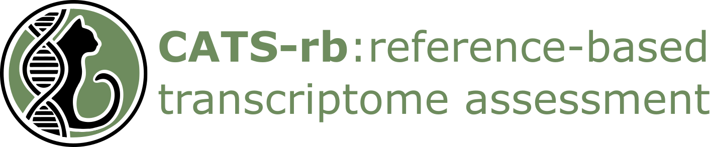

# CATS-rb

## Documentation

- [Introduction](#introduction)
- [Installation](installation.md)
- [Test data](test-data.md)
- [Example usage](usage.md)
- [Detailed options](options.md)
- [Output explanation](output.md)
- [Citation](citation.md)
- [Troubleshooting](troubleshooting.md)
- [Changelog](changelog.md)

# Introduction 

CATS-rb is the reference-based module of the CATS (Comprehensive Assessment of Transcript Sequences) framework. It evaluates transcriptome assembly quality using the reference genome of the corresponding or a closely related species. The pipeline maps transcripts to the reference genome and examines several mapping and completeness metrics.

The main contribution of CATS-rb is transcriptome assembly completeness analysis, which can be performed in two settings: 

- Relative completeness analysis: requires two or more transcriptome assemblies
- Annotation-based completeness analysis: requires one or more transcriptome assemblies and a reference gene annotation GTF/GFF3 file

Completeness analysis introduces exon and transcript sets as units for assembly comparison, collectively referred to as element sets. Precisely, CATS-rb collapses overlapping exon and transcript genomic coordinates of a given assembly into non-redundant exon and transcript sets, respectively. Completeness of exon/transcript sets is compared between the analysed assemblies by constructing an undirected graph in which vertices represent exon/transcript sets and edges indicate overlaps between the corresponding sets of the compared assemblies. Overlapping exon/transcript sets are grouped into connected components, with the longest set designated as the group representative.

Element set completeness is quantified by its relative length compared to the representative set. Relative exon and transcript scores for each transcriptome assembly are computed as the mean of exon and transcript set completeness, respectively. Alongside completeness scores, CATS-rb also provides an in-depth analysis and visualization of missing, common, and unique element sets.

Additionally, CATS-rb can perform an annotation-based analysis using reference element sets derived from a GTF genome annotation file. This workflow follows the same principles as relative completeness analysis, while grouping transcriptome assembly element sets based on shared overlaps with reference sets. As such, reference sets are considered the representative for each set assembly set group. Annotation-based exon and transcript scores are calculated analogously to relative exon and transcript scores, offering an absolute measure of assembly completeness. Both relative and annotation-based scores are normalized to a range between 0 and 1, where higher values indicate higher completeness.

CATS-rb exon and transcript scores exhibit a strong correlation with transcriptome assembly quality. Furthermore, relative and annotation-based scores are strongly correlated when applied to assembly sets with varying quality, enabling precise assembly quality assessment without strictly requiring reference annotation. 

For detailed benchmarks and methodology, please refer to the CATS [preprint](https://www.biorxiv.org/content/10.1101/2025.07.22.666112v1)

## Use cases

A typical CATS-rb analysis generally fits into one of the following use cases:

- Assessing accuracy and completeness of one or more transcriptome assemblies relative to the reference transcriptome assembly and/or reference gene annotation
- Comparing relative accuracy and completeness of transcriptome assemblies generated from the same RNA-seq library
- Comparing transcriptomic content between transcriptome assemblies generated from different RNA-seq libraries
